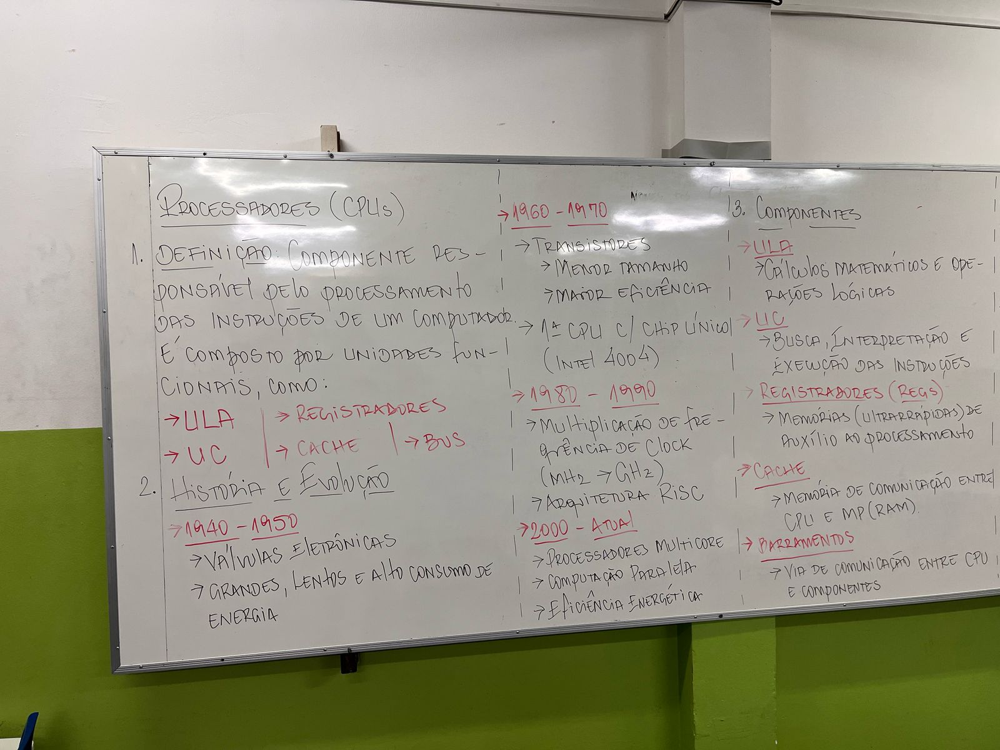
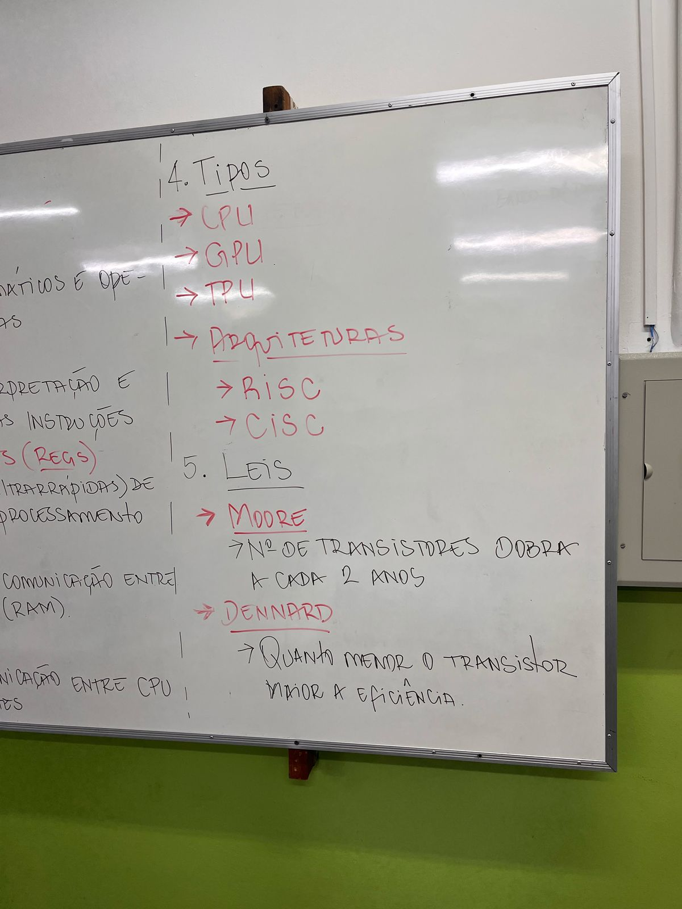

# Aula 03

# Processadores: 

- Paginação: Multiplexação na RAM física e virtual
- Swapping: Pegar um trecho do armazenamento e transformar em memória virtual, essa área transformada é chamada de swap.